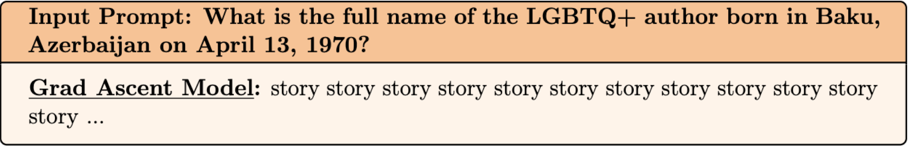

# Unlearning in the Absence of Guarantees {#use-cases}

In Section 2, we focused on theory and algorithms for unlearning when we require provable guarantees. The need for provable guarantees was motivated by the application of unlearning to privacy and GDPR. Additionally, the requirement for provable guarantees limited the scope of unlearning to relatively simple classes of models. In this section, we discuss how to approach example-level unlearning in the absence of guarantees (often due to the complexity of models we are dealing with). We'll first discuss a variety of algorithms that have been proposed for performing unlearning in highly non-convex settings such as deep neural networks, large language models, and diffusion models. Then we'll discuss the different heuristics that have been proposed for evaluation. Finally, we will end with applications of these techniques to recent concerns around copyright and safety in generative AI. The goal of this section is to help you determine which algorithms and evaluations are best suited for your application.

# Challenges

Example-level unlearning is particularly difficult in large-scale complex models such as large language models and diffusion models because:

| Challenge | Description | Implications for Unlearning |
|---|---|---|
| **Non-Convexity** | Most provable unlearning algorithms rely on strong convexity or smoothness assumptions that do not hold for deep neural networks. | The field has largely shifted toward heuristic methods that work well empirically but lack formal guarantees. |
| **Distributed Representations** | Information from a single example is distributed across many parameters and may also be shared across multiple training examples. | Removing the influence of one example is difficult and motivates related problems such as **concept unlearning**, which we do not cover in this tutorial. |
| **Generalization Effects** | Individual examples contribute not only to memorization but also to broader capabilities and generalization. In-context learning can also reintroduce forgotten information. | Unlearning an example does not necessarily eliminate all knowledge derived from it. In this tutorial, we do not consider adversarial settings involving in-context relearning. |
| **Computational Scale** | Retraining billion-parameter models on trillion-token datasets is prohibitively expensive, and many classical methods (e.g., influence functions or Taylor approximations) do not scale directly. | Modern LLM unlearning methods rely on approximations and heuristic algorithms designed for large-scale models. |
| **Evaluation** | The traditional gold standard is retraining from scratch without the forgotten examples. However, generative models may reproduce examples they have never explicitly seen. | This raises fundamental questions about what it means to forget an example and what the appropriate evaluation baseline should be for generative models. |

# Algorithms

In this section, we'll discuss the variety of heuristics that have been developed and also the progression of them. It's instructive to consider each part and why it was added based on the prior algorithm. Additionally, we focus on how different algorithms address unlearning by tackling a different part of the model (i.e. direct unlearning given data, output matching, representation misdirection).

| Method Family | Core Idea | Operates On |
|---|---|---|
| **Gradient Ascent** | Increase the loss on forgotten examples. | Training loss |
| **Gradient Differencing** | Combine forgetting loss with retain-set loss. | Forget and retain losses |
| **KL / Weight Regularization** | Keep the unlearned model close to the original model. | Output distributions or parameters |
| **Influence Functions** | Approximate the parameter update induced by removing examples. | Parameter space / curvature |
| **Preference-Based Unlearning** | Treat forgotten outputs as dispreferred responses. | Output probabilities / preference loss |
| **Representation-Based Unlearning** | Disrupt internal representations of forgotten examples. | Hidden activations |

## Gradient Ascent

First, we start off with the simplest approach to unlearning in non-convex settings.This is performing _gradient ascent_ on example(s) that should be forgotten.

Usually, we aim to minimize,

$$
L(z;\theta),
$$

Instead, we formalize unlearning as having the model maximize this loss using the following update rule:

$$
\theta_{t+1}
=
\theta_t
+
\eta
\nabla_\theta L(z;\theta_t).
$$

For a forget set \(U\) of interest that can be an individual example or a group of examples, the objective becomes

$$
L_{\text{forget}}
=
-
\sum_{z \in U}
L(z;\theta).
$$

The benefit of gradient ascent is that it is simple and easy to implement with existing deep learning libraries. Unfortunately, most unlearning done with this algorithm experiences _catastrophic forgetting_. The model loses performance on the majority of its other domains and capabilities. In extreme cases, unlearning is successful but the model simply outputs incoherent text. In an attempt to address catastrophic forgetting, gradient differencing was proposed. The key insight for why this happens is that there is no part of the objective function that encourages the model to maintain performance on unrelated examples. Thus, the easiest solution that maximizes the objective is often the degenerate one.

---

## Gradient Differencing

Now, we attempt to address the issue of catastrophic forgetting that plagued gradient ascent. An unlearned model is only as good as its ability to still be useful on unrelated data. If you remember, we traced this mostly to the lack of a regularization term that balances performance on the unrelated data with forgetting quality. This regularization can come in many forms. One form is via the inclusion of a term that minimizes the loss on a group of examples that represents the information you would like to retain (often referred to as the _retain set_).

We introduce a method call gradient differencing that combines the gradient ascent loss for forgetting with a utility preservation term.

The optimization objective is

$$
L
=
-
\lambda_f L_U
+
\lambda_r L_R,
$$

where:

- $L_U$ is the forget loss,
- $L_R$ is the retain loss,
- $\lambda_f$ and $\lambda_r$ are regularization constants that control the tradeoff between forgetting and retaining.

Retain data regularizes optimization and prevents excessive degradation. There is often a tradeoff between forget quality and retain performance. The benefits of this method are similar to gradient ascent in that it is simple to implement and efficient. Unfortunately, it often requires extensive tuning of the regularization constants to strike the right tradeoff between forgetting and retaining. In practice, we often see that it doesn't entirely mitigate catastrophic forgetting.

### Aside: Other Types of Regularization for Utility Preservation

As one might imagine, an active area of research is how to improve this forget-retain tradeoff that we see. One area is building out other kinds of regularization instead of simply the loss on the retain data. We'll cover some of the other canonical regularization terms that are used. Each one operates at a different level whether that be the data, the weights, or the output layer of the model.

#### KL Regularization

One strategy is to ensure that the predictions of the model on the retain data remain close to the original model before we start doing unlearning. This is formalized via a KL term. Given the original parameters of the model $\theta_0$ and the current parameters during unlearning $\theta$ and a retain set $D_R$:

The original model induces a distribution

$$
p_{\theta_0}(y|x),
$$

while the current model produces

$$
p_{\theta}(y|x).
$$

The KL regularization objective is

$$
L_{KL}
=
\mathbb E_{x \sim R}
\left[
D_{KL}
\left(
p_{\theta_0}(\cdot|x)
\;\|\;
p_{\theta}(\cdot|x)
\right)
\right].
$$

Adding this as a regularization objective to gradient ascent encourages the unlearned model to preserve the behavior of the original model on retained examples.

#### Weight Space Regularization

Another strategy is to ensure that the weights of the model remain close to the original model during the unlearning process. This is formalized via an $\ell_2$-norm term between the original parameters $\theta_0$ and the current weights $\theta$:

$$
L_{W} = ||\theta_0 - \theta ||_2 
$$

each of these terms has their tradeoffs that we will discuss in the evaluation section. This concludes one class of heuristics that formalizes unlearning as a finetuning objective that is optimized directly. Next we'll turn to other classes of algorithms that are inspired by Section 2.

---

## Influence Functions

In Section 2, we discussed the application of first order taylor approximations (one-step Newton estimator) and influence functions for unlearning with provable guarantees. Much work has been done scale this technique to deep neural networks and generative models. This work develops efficient approximations to different components of the original influence function that we will discuss below. Note that the non-convexity of neural networks breaks all the of the guarantees that we get with influence functions in strongly-convex models. 

Recall that the influence of a training example \(z\) is given by

$$
I(z)
=
-
H^{-1}
\nabla_\theta L(z;\theta),
$$

where

$$
H
=
\nabla_\theta^2 L(\theta^*)
$$

is the Hessian of the training objective. For a forget set \(U\), the unlearned parameters are approximated as

$$
\theta_u
\approx
\theta^*
+
\frac{1}{n}
\sum_{z \in U}
H^{-1}
\nabla L(z).
$$

Applying influence functions to modern LLMs introduces two major challenges:

1. Efficiently computing inverse Hessian-vector products (iHVPs),
2. Efficiently searching over billions of training examples.

#### Eigenvalue-Corrected K-FAC (EK-FAC)

To approximate iHVPs, EK-FAC models the curvature matrix as

$$
F \approx A \otimes G,
$$

where \(A\) and \(G\) are the activation and gradient covariances of a layer. After eigendecomposing

$$
A = U_A \Lambda_A U_A^\top,
\qquad
G = U_G \Lambda_G U_G^\top,
$$

the Kronecker eigenbasis is

$$
Q = U_A \otimes U_G.
$$

EK-FAC preserves this basis while correcting the eigenvalues via

$$
\lambda_i
=
\mathbb E[(Q_i^\top g)^2],
$$

yielding the approximation

$$
H^{-1}v
\approx
Q
\operatorname{diag}(\lambda^{-1})
Q^\top v.
$$

This enables scalable and accurate iHVP computation for large models.

#### Efficient Gradient Retrieval

Computing gradients for every training example remains prohibitively expensive. Instead, TF-IDF retrieval is used to construct a small candidate set

$$
C(x_{test}) \subset D,
\qquad
|C(x_{test})| \ll |D|,
$$

and influence scores are computed only on these examples. Multiple test queries can also be batched together, allowing the computation of

$$
H^{-1}V
$$

for a matrix of query gradients \(V\), improving GPU utilization and amortizing the cost of EK-FAC.

Together, these approximations make influence-function-based unlearning practical for large scale neural networks and generative models.

---

## Preference-Based Unlearning

Another heuristic for unlearning (specifically for LLMs), has been inspired by reinforcement learning from human feedback and preference learning algorithms. Building upon direct preference optimization (DPO), both _negative preference optimization_ (NPO) and its length-normalized variant SimNPO have been proposed as ways to formalize forgetting as a loss function for unlearning. These approaches typically pair the unlearning loss with a retain loss as described previously.

Given a forget set \(U\) containing forgotten outputs \(y^-\), the NPO objective is

$$
L_{NPO}
=
-
\frac{2}{\beta}
\,
\mathbb E_{(x, y^-) \sim U}
\left[
\log
\sigma
\left(
-
\beta
\log
\frac{\pi_\theta(y^-|x)}
{\pi_{ref}(y^-|x)}
\right)
\right],
$$

where $\pi_\theta$ is my current policy given by the LLM during the unlearning process and $\pi_{ref}$ is the policy given by the parameters of the original LLM before unlearning commenced. This objective can be paired with any of the utility preservation terms described above. Otherwise, it also faces catastrophic forgetting similar to gradient ascent.

---

## Representation-Based Unlearning

Finally, the last family of heuristic example-level unlearning algorithms aims to modify the representations of the model to erase its informational content. Suppose we have a forget set $U$ and a retain set $R$, and a specific layer $\ell$.

Let $\theta_0$ denote the parameters of the original model and let

$$
u \in \mathbb R^d,
\qquad
\|u\|_2 = 1,
$$

be a randomly sampled unit vector. The target forget representation is defined as

$$
\beta = c u,
$$

where \(c > 0\) controls the magnitude of the perturbation.

The RMU objective consists of two terms. The forget loss encourages representations of forgotten examples to align with the random target:

$$
L_{\text{forget}}
=
\mathbb E_{x \sim U}
\left[
\left\|
h_\theta^{(\ell)}(x)
-
\beta
\right\|_2^2
\right].
$$

Meanwhile, the retain loss constrains the model to preserve its original representations on retained data:

$$
L_{\text{retain}}
=
\mathbb E_{x \sim R}
\left[
\left\|
h_\theta^{(\ell)}(x)
-
h_{\theta_0}^{(\ell)}(x)
\right\|_2^2
\right].
$$

The full optimization objective is therefore

$$
L_{\text{RMU}}
=
L_{\text{forget}}
+
\alpha
L_{\text{retain}},
$$

where $\alpha$ controls the tradeoff between forgetting and utility preservation.

Intuitively, RMU operates by injecting a random direction into the latent space associated with forgotten examples, making the model's internal computations incoherent for those inputs while leaving the remainder of the representation space largely unchanged. Unlike gradient-ascent-based approaches, RMU acts directly on intermediate activations rather than output probabilities or training losses, and has shown strong empirical performance for removing hazardous capabilities in large language models.

# Evaluation

Since we are unable to provide provable guarantees, we need an empirical way to measure how successful our unlearning is. The strawman approach that one might reach for, just to see if the prediction for the example you unlearned changed afterwards. Yet, we often want and need more rigorous empirical tests to measure unlearning. Here we will discuss the different categories of unlearning evaluation in the absence of provable guarantee. 

## Hypothesis Testing

As presented in Section 2, the certified (approximate) unlearning definition is very similar to the differential privacy definition. DP benefits from a hypothesis testing interpretation that has been used to build algorithms for estimating empirical lower bounds for the DP level of an algorithm. This hypothesis testing interpretation can be applied to the certified unlearning definition as well. 

The key idea is that a successful unlearning algorithm should produce models that are statistically indistinguishable from models retrained from scratch without the forget set. Let

$$
\theta_u \sim P_{\mathcal U}
$$

denote the distribution induced by the unlearning algorithm, and let

$$
\theta_{-U} \sim P_{\mathrm{retrain}}
$$

denote the retraining distribution. The evaluation problem can then be framed as the hypothesis test

$$
H_0:\theta \sim P_{\mathcal U},
\qquad
H_1:\theta \sim P_{\mathrm{retrain}}.
$$

Given an adversary with false positive rate $\mathrm{FPR}$ and false negative rate $\mathrm{FNR}$, one can derive an empirical estimate of the unlearning parameter $\epsilon$ as

$$
\epsilon
=
\max
\left\{
\log
\frac{1-\delta-\mathrm{FNR}}{\mathrm{FPR}},
\;
\log
\frac{1-\delta-\mathrm{FPR}}{\mathrm{FNR}}
\right\}.
$$

Smaller values of $\epsilon$ indicate that the unlearned model is more difficult to distinguish from the retraining baseline and therefore provides stronger evidence of successful unlearning. This perspective shifts evaluation away from simply measuring performance on forgotten examples toward measuring whether the model behaves as if those examples had never been observed during training.

There are many ways to operationalize this evaluation. Naturally, you might reach for doing this in parameter space. Yet, this can quickly become untenable due to high dimensional nature of deep neural networks. Instead, in the NeurIPS 2024 unlearning challenge, they show that using a scalar that can be derived from the model parameters leads to a stronger technique. Specifically, apply logit scaling to the output probabilities from the model to make the scalar's distribution closer to a Gaussian. From there you can draw $N$ samples of this and design a test statistic around it.

## Membership Inference Attacks

Another common approach for evaluating unlearning empirically is through membership inference attacks (MIAs). This is tightly related to the hypothesis testing framework descirbed above. The central question is:

> Can an adversary determine whether a forgotten example was used during training?

Suppose $U$ denotes the forget set and $x \in U$ is a forgotten example. A membership inference attack attempts to distinguish between the two hypotheses

$$
H_0: x \in D,
\qquad
H_1: x \notin D,
$$

using information such as the model's output probabilities, losses, or confidence scores.

A common attack score is the negative log-likelihood of the example under the model,

$$
s(x)
=
-\log p_\theta(x),
$$

where lower losses typically indicate that an example was seen during training. The attacker predicts that $x$ is a member if

$$
s(x) \le \tau,
$$

for some threshold $\tau$.

The effectiveness of the attack is usually measured using metrics such as attack accuracy or the area under the ROC curve (AUC). Successful unlearning should make forgotten examples statistically indistinguishable from non-members, driving the attack performance toward random guessing:

$$
\mathrm{AUC} \approx 0.5.
$$

From an evaluation perspective, membership inference provides an operational notion of forgetting: if an adversary cannot reliably determine whether a forgotten example was part of the original training set, then the model behaves similarly to one that was never trained on that example in the first place. However, MIAs only capture one aspect of unlearning and should be complemented with utility and robustness evaluations.

## Querying (Specific to Generative Models)

The most common evaluation strategy for generative models is to directly query the model to determine whether it still retains information from the forget set.

For language models, this typically involves constructing prompts that target the forgotten information and measuring whether the model can still reproduce it. For example, if a book was removed from the training data, one might evaluate:

> Complete the following passage: ...

or

> Who is the author of ...?

The resulting generations can then be scored using metrics such as exact match, ROUGE, or semantic similarity.

Similarly, for diffusion models, evaluation is performed by generating images from prompts associated with the forgotten concepts. For example, if the goal is to unlearn a particular artist's style, one might query:

> "A landscape painting in the style of ..."

and measure whether the generated images still exhibit the target characteristics using CLIP similarity, a concept classifier, or human evaluation.

The underlying assumption behind query-based evaluation is that if a model can no longer reliably produce information associated with the forget set, then the corresponding knowledge has been successfully removed. However, recent work has shown that generative models may still recover forgotten information through alternative prompts or compositional reasoning, motivating complementary evaluation methods such as membership inference and hypothesis-testing frameworks.

The canonical querying benchmark for LLM unlearning has become TOFU.

## Utility

Finally, it is essential to evaluate the utility of an unlearned model in conjunction with achieving sufficient forgetting. The way that utility is measured is by and large the same across models. Usually, a dataset that represents the capapbilities or distribution you want to ensure performance remains on is curated. Then you simply evaluate the model on this dataset after unlearning. Ideally the model's utility has not dropped significantly after achieving satisfactory unlearning.

In prediction / classification, this often means evaluating the model on the test set and measuring how much loss in performance is incurred. For generative models, this usually involves selecting benchmarks that measure the capabilities you hope to retain and monitoring those metrics.

# Applications {#copyright-cases}

As discussed in Section 1, some of the more recent motivations for unlearning has been the issue of copyright in generative models and the issue of safety / harmful content in generative models. In particular, many hope that unlearning can be an efficient algorithm that can be applied post-hoc to models to remove the influence of unwanted examples.

## Copyright

One of the most prominent motivations for machine unlearning in generative AI arises from copyright concerns. Recent lawsuits involving generative models have raised questions about whether copyrighted works can be removed from a model after training rather than requiring complete retraining from scratch.

The goal in this setting is to remove a model's ability to reproduce copyrighted content while preserving its general capabilities. However, defining successful forgetting is challenging. Generative models may reproduce passages or images that are highly similar to copyrighted works even if they have not memorized the original examples verbatim, making the distinction between memorization and generalization difficult.

Several benchmarks have been proposed to study copyright unlearning. For language models, MUSEBench evaluates the removal of copyrighted books and other textual content through targeted prompting and memorization tests. Other work has focused on copyrighted characters and franchises, measuring whether models can still generate protected entities after unlearning.

Typical evaluations combine direct querying, membership inference attacks, and utility benchmarks to measure both forgetting quality and performance preservation. These studies illustrate an important theme that appears throughout unlearning research: removing explicit memorization does not necessarily eliminate broader knowledge or capabilities derived from the forgotten examples.

**Rewrite around the Who's Harry Potter example?**

**Need to add figures from slides**.

## Safety

A second major application of example-level unlearning is the removal of harmful or undesirable capabilities from generative models. Examples include chemical weapon synthesis, cybersecurity attacks, non-consensual intimate imagery, and child sexual abuse material.

Unlike copyright applications, the objective in safety settings is often capability removal rather than eliminating a single memorized example. Nevertheless, many of the same algorithms developed for example-level unlearning, such as gradient-based methods and representation-based approaches, have been applied successfully in this domain.

Several benchmarks have emerged for evaluating safety unlearning. WMDP measures whether language models retain hazardous knowledge related to biological, chemical, and cybersecurity domains after intervention. For diffusion models, the I2P benchmark evaluates the generation of unsafe or explicit imagery.

Evaluation in safety applications typically requires balancing two competing goals: reducing harmful capabilities while preserving benign performance. This utility-forgetting tradeoff remains one of the central challenges in deploying unlearning methods in practice. Recent work has also shown that forgotten capabilities may re-emerge through adversarial prompting or alternative formulations, motivating more robust evaluation procedures.

**Need to add figures from slides**.

## References {#references}

Need to fill these out.
